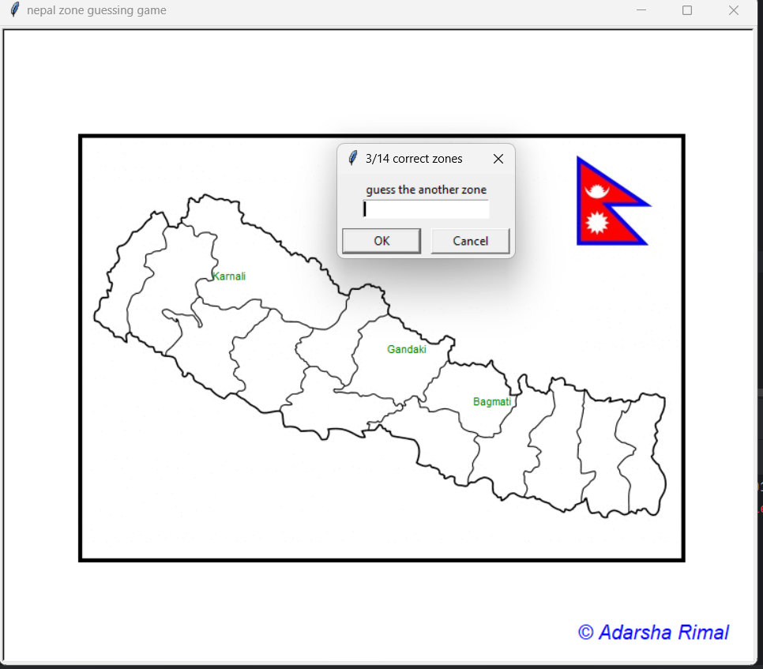

# Nepal Zone Guessing Game

Welcome to the **Nepal Zone Guessing Game**, an interactive Python project that challenges you to identify and guess the zones of Nepal on a map. This project is built using the `turtle` graphics module and the `pandas` library, making it both visually engaging and educational.



## Features

- **Interactive Map**: The game uses a graphical representation of Nepal, where players can guess the zones by typing their names.
- **Progress Tracking**: The game displays the number of correct guesses made so far, helping you keep track of your progress.
- **Watermark**: A custom watermark is displayed on the screen, adding a personalized touch to the game.
- **Learning Feature**: If you choose to exit the game before identifying all the zones, a CSV file named `zones_to_learn.csv` will be generated. This file contains the zones you missed, allowing you to study and improve.

## How to Play

1. **Setup**: Make sure you have Python installed on your system along with the required libraries (`turtle`, `pandas`).
2. **Run the Game**: Execute the Python script in your preferred IDE or terminal.
3. **Guessing Zones**: A map of Nepal will be displayed. You need to guess the names of the zones by typing them into the text box that appears.
   - The game will track the number of correct guesses.
   - If you guess a correct zone, it will be marked on the map in green.
4. **Exiting the Game**: Type "Exit" when you wish to stop playing. The game will save the zones you missed into a CSV file for future learning.

## Prerequisites

- Python 3.x
- Required Python libraries:
  - `turtle`
  - `pandas`

You can install the required libraries using pip:

```bash
pip install pandas
